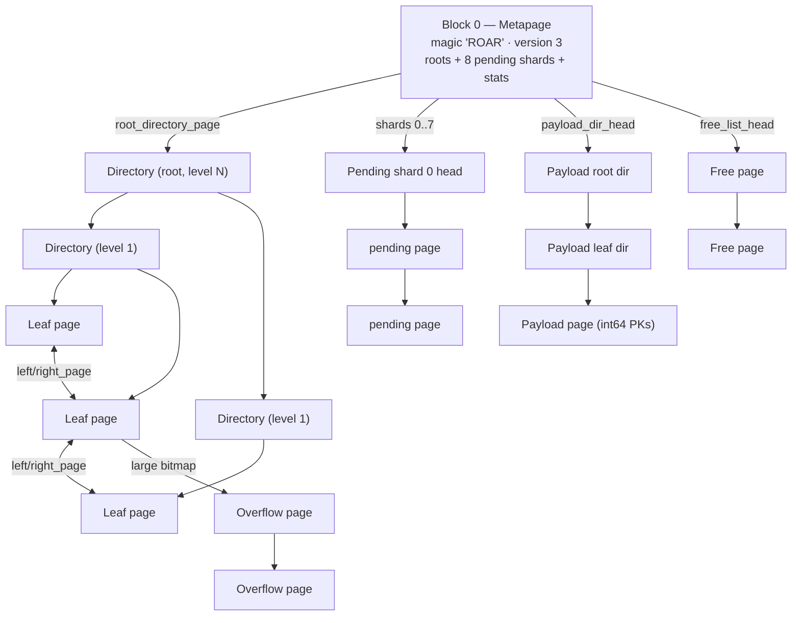
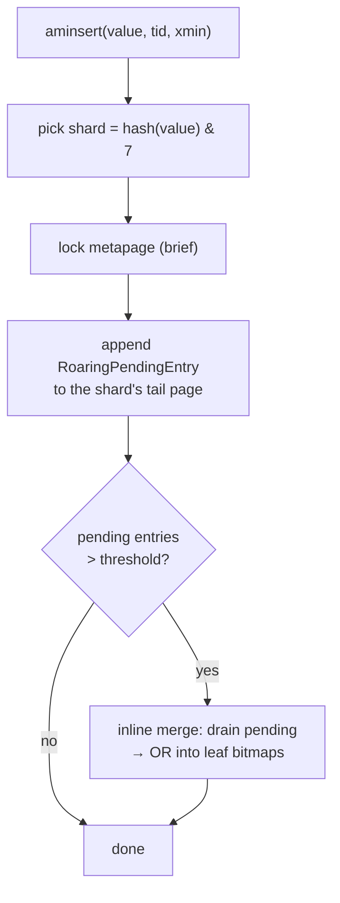
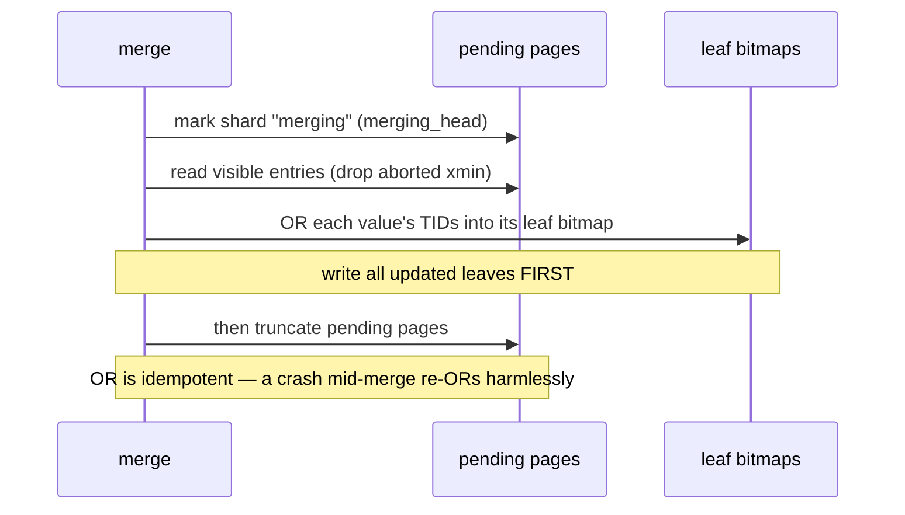
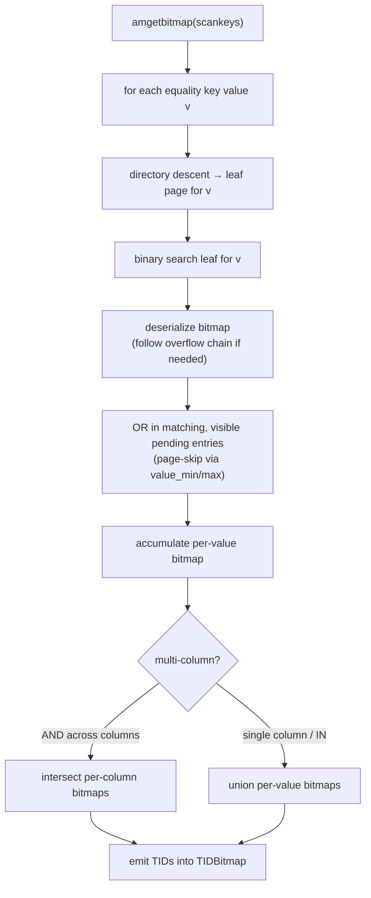
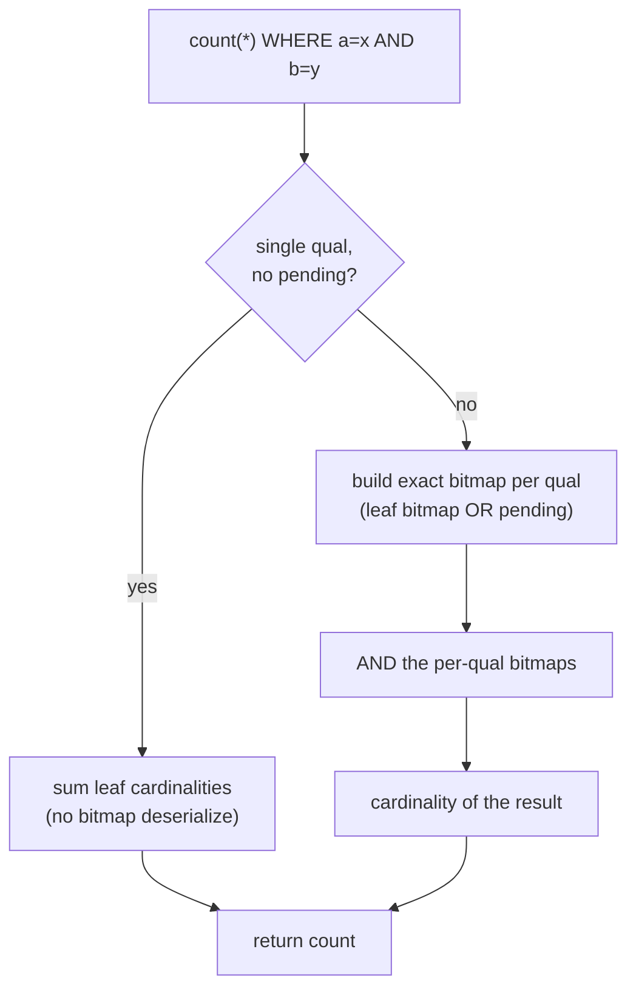

# pg_roaring_index — Design

This document describes the on-disk layout and the read / write / merge
protocols of `pg_roaring_index`. For *why* and *when* to use it, see the
[README](README.md).

- [Model](#model)
- [On-disk layout](#on-disk-layout)
- [Page types](#page-types)
- [Key encoding](#key-encoding)
- [Write path](#write-path)
- [Read path](#read-path)
- [`count(*)` fast path](#count-fast-path)
- [`INCLUDE` payload store](#include-payload-store)
- [Concurrency, MVCC & WAL](#concurrency-mvcc--wal)
- [Build](#build)

---

## Model

The index maps each **distinct value** of an indexed column to a
[Roaring bitmap](https://roaringbitmap.org/) (`roaring64`) of the **linearized
TIDs** of the heap rows that hold that value:

```
linear_tid = (block_number << 9) | (item_offset - 1)
           ──────────────────────   ─────────────────
              55 bits of block        9 bits of offset (≤ 511 tuples/page)
```

A scan for `col = v` is therefore: *find v's bitmap, deserialize it, hand its
TIDs to the executor*. A scan for `a = x AND b = y` intersects two bitmaps. A
`count(*)` reads cardinalities and never materializes a row.

To make lookups cheap, values are kept in a sorted **directory** (a shallow
B-tree-like structure, 1–3 levels) that points at **leaf pages**. Each leaf packs
many `(value → bitmap)` entries; a value whose serialized bitmap is too large for
a leaf spills to an **overflow chain**.

---

## On-disk layout

Block 0 is always the **metapage**; it roots four independent structures.



- **Directory** pages form a sorted tree over `high_key` values; the leaf level
  is a **doubly-linked list** (`left_page` / `right_page`) so prefix and
  full-index walks are sequential.
- **Pending** rows are appended to one of **8 shards** (write concurrency) and
  periodically merged into the leaf bitmaps.
- The **payload** store holds `INCLUDE` column values, addressed directly by
  `linear_tid` for index-only projection.
- Freed pages (after merges / vacuums) are recycled via the **free list**.

---

## Page types

Every page carries a 1-byte `page_type` tag in its special area.

| Tag | Page | Special-area fields |
|----:|------|---------------------|
| `0x01` | Metapage | roots, per-shard state, `total_entries`, threshold |
| `0x02` | Directory | `level`, `entry_count`, `right_page` |
| `0x03` | Leaf | `entry_count`, `left_page`, `right_page` |
| `0x04` | Overflow | `next_page` |
| `0x05` | Pending insert | `entry_count`, `next_page`, `value_min/max`, `xmin_low` |
| `0x06` | Free | free-list link |
| `0x07` | Payload | `entry_count`, `next_page` |
| `0x08` | Payload directory | `entry_count` |

### Metapage (`RoaringMetaPageData`)

`magic = 0x524F4152 ("ROAR")`, `version = 3`, the CRoaring portable-format
version (validated on open), `num_shards = 8`, the four structure roots
(`root_directory_page`, `leftmost/rightmost_leaf_page`, `payload_dir_head`,
`free_list_head`), `total_entries` (distinct-value count, used by the cost
estimator and `count(*)` planning), the pending-merge threshold, and the 8
`RoaringPendingShard` records (`insert_head/tail/count`, `merging_head`,
`carry_head`).

### Directory (`RoaringDirEntry` + `RoaringDirSpecial`)

A flat, sorted array of 16-byte entries `{ int64 high_key; BlockNumber child_page }`,
no line pointers. `level = 0` means children are leaf pages; `level = N>0` means
children are directory pages at level `N-1`. A binary search per level descends
to the leaf. With ~510 entries per page, three levels address ~510³ ≈ **130M
leaf pages**.

### Leaf (`RoaringLeafEntry` / `RoaringOverflowEntry`)

Standard PostgreSQL line-pointer layout. Entries are sorted by `value` and
binary-searched within the page. Two shapes share a header
`{ int64 value; uint32 cardinality; uint8 flags }`:

- **Inline** (`flags = INLINE`): the serialized bitmap bytes follow the header on
  the page.
- **Overflow** (`flags = OVERFLOW`): the header is followed by
  `{ BlockNumber overflow_blkno; uint32 total_len }`; the bitmap bytes live in an
  overflow chain (`page_type 0x04`, linked by `next_page`).

`cardinality` lets `count(*)` answer single-value counts **without
deserializing** the bitmap. `RoaringLeafSpecial` chains leaves both ways for
ordered/prefix and full-index scans.

### Pending insert (`RoaringPendingEntry` + `RoaringPendingSpecial`)

Fixed 24-byte entries `{ int64 value; uint64 linear_tid; TransactionId xmin }`,
**339 per page**, append-only. Each page's special area carries `value_min` /
`value_max` for **page-level skipping** during scans and `xmin_low` for
visibility shortcuts. Pages chain via `next_page` within a shard.

---

## Key encoding

A **single-column** index stores the column's value as a 64-bit key directly
(`roaring_datum_to_key64`), preserving the full domain — notably lossless `int8`.

A **multi-column** index namespaces every column into one 64-bit key space by
tagging the high 32 bits with the 1-based attribute number:

```
ROARING_COL_KEY(attno, v32):

  63          32 31           0
  ┌─────────────┬─────────────┐
  │   attno     │  key32(v)   │
  └─────────────┴─────────────┘
```

`key32(v)` is the value for types that fit in 32 bits (`int2/int4/oid/date/bool/
float4/enum`), or a 32-bit **hash** for `text`, `uuid`, and `int8`. Hashed
columns set `xs_recheck`, so the executor re-verifies the predicate on the heap
and the answer stays exact despite collisions. Per-column bitmaps live in the
**same** directory/leaf structure — a multi-column index is, on disk, a single
keyspace whose values are column-tagged — and the scan intersects them.

> A lossless multi-column `int8` key (per-column directories / covering store) is
> on the roadmap; see `TODO.md`.

**NULL bitmaps.** Rows whose column is NULL are recorded under a dedicated
per-column key `NULL_COL_KEY(attno) = ((attno | 0x8000_0000) << 32)`, which sets
the high attno-bit so NULL keys sort into the **negative** end of the int64 key
space, disjoint from the (positive) value keys. `amsearchnulls` is therefore
true: `col IS NULL` reads that bitmap directly (and intersects with other quals,
e.g. `a = x AND b IS NULL`); `col IS NOT NULL` is the full index TID set with the
NULL bitmap removed. Because a NULL key is just another key, it flows through the
same leaf/overflow/pending/merge machinery — no separate structure.

---

## Write path

`aminsert` appends to the pending list rather than rewriting bitmaps:



- **Sharding** (8 ways) lets concurrent writers contend only when they hash to
  the same shard.
- The whole append holds the metapage lock briefly, eliminating the
  allocate/append TOCTOU without a retry loop.
- **Back-pressure**: when a shard exceeds the threshold (à la
  `gin_pending_list_limit`), the insert triggers an inline merge instead of
  letting the list grow unbounded.

### Merge

`VACUUM` (and back-pressure) merge pending entries into the leaf bitmaps:



The leaves-before-truncate ordering plus the `merging_head` anchor make the merge
**crash-safe**: replaying a half-finished merge re-ORs the same TIDs into the same
bitmaps, which is a no-op.

---

## Read path

`amgetbitmap` builds a `TIDBitmap` for the scan keys:



`IN (...)` / `= ANY` walk the leaf chain once for clustered values
(amsearcharray). Because results are always the **union of the persisted bitmaps
and the visible pending entries**, queries are correct between merges.

`amgettuple` (Index / Index-Only Scan) iterates the combined bitmap one TID at a
time; for an `INCLUDE` projection it reads the value from the payload store.

---

## `count(*)` fast path

A planner hook installs a `Custom Scan (RoaringCount)` for
`count(*) … WHERE <equality predicates on roaring columns>`:



The single-qual path is `O(matched leaf pages)` — it reads stored cardinalities
and never deserializes a bitmap, which is why `count(*) WHERE col = v` is
near-instant regardless of how many rows match. Multi-qual counts pay one
bitmap deserialize + intersection per qual. Hash-encoded (recheck) columns
decline this path and fall back to a recheck scan to stay exact.

---

## `INCLUDE` payload store

An `INCLUDE (id)` column is stored densely, keyed by `linear_tid`, in a
two-level directory of payload pages so an Index-Only Scan can project `id`
without a heap fetch:

```
linear_tid ─▶ payload_idx = linear_tid / 8192
              ├─ dir_root_idx  = payload_idx / 2040  ─▶ root dir slot
              ├─ dir_leaf_idx  = payload_idx % 2040  ─▶ leaf dir slot ─▶ payload page
              └─ chunk_offset  = linear_tid % 8192   ─▶ entry within the page chain
```

Payload pages hold sorted `{ uint16 chunk_offset; int64 pk }` entries (≤ 510 per
page, chained). Because an Index-Only Scan delivers TIDs in **ascending** order,
the scan uses a **forward-only streaming cursor** that caches the resolved
directory levels and the current page, reading each payload page once per scan
instead of re-walking the directory per row. (On a 27M-row aggregate this cut
buffer accesses ~180×.)

---

## Concurrency, MVCC & WAL

- **MVCC.** Pending entries carry `xmin`; a GIN-style four-state visibility check
  (own-xid / committed / in-progress / aborted, plus frozen) gates them at scan
  time. Aborted entries are dropped during merge and vacuum.
- **Locking.** Readers take `BUFFER_LOCK_SHARE`; writers take
  `BUFFER_LOCK_EXCLUSIVE`. Buffers are always released on error paths via
  `PG_TRY` / `PG_FINALLY`.
- **WAL.** Every page modification goes through `generic_xlog` — there is **no
  custom WAL resource manager**. The crash-recovery anchor for an interrupted
  merge (`merging_head`) plus idempotent OR semantics make recovery a no-op
  replay. `REINDEX CONCURRENTLY` works without special handling.

---

## Build

`ambuild` performs a single sort-then-batch pass:

1. Scan the heap, emitting one `(key, linear_tid)` per indexed key column per row
   into a `tuplesort` (spills to disk under `maintenance_work_mem`).
2. Stream the sorted `(value, tid)` runs, accumulating one bitmap per value
   group and writing leaf pages as groups complete.
3. Build the directory bottom-up over the emitted leaf pages.

The build is **single-threaded** today (parallel `tuplesort` is on the roadmap);
the directory grows to 1–3 levels as the distinct-value count requires. The
payload store for `INCLUDE` columns is populated in the same heap pass.
